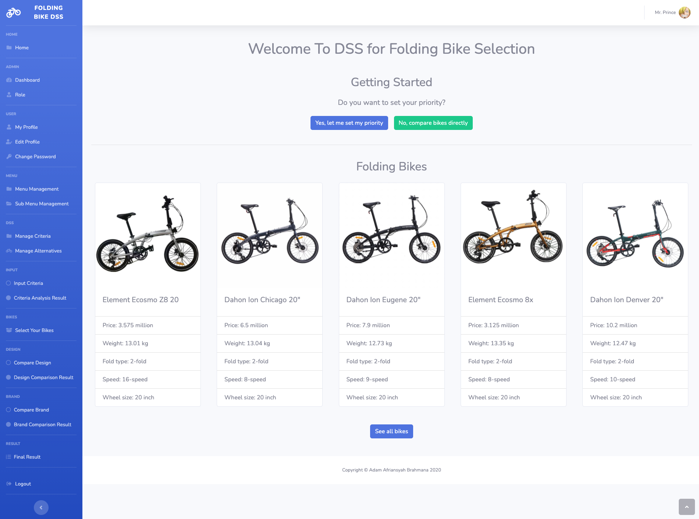
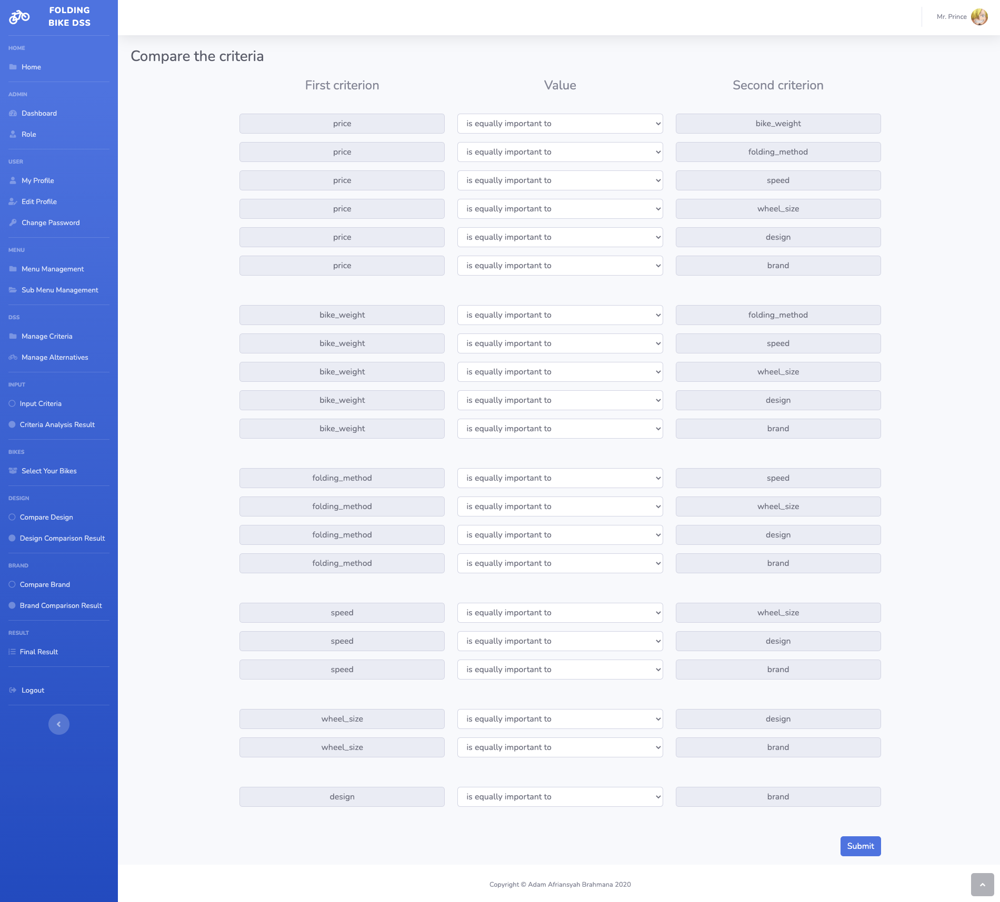
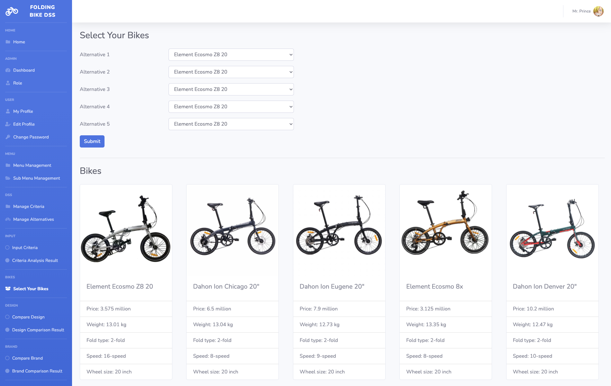
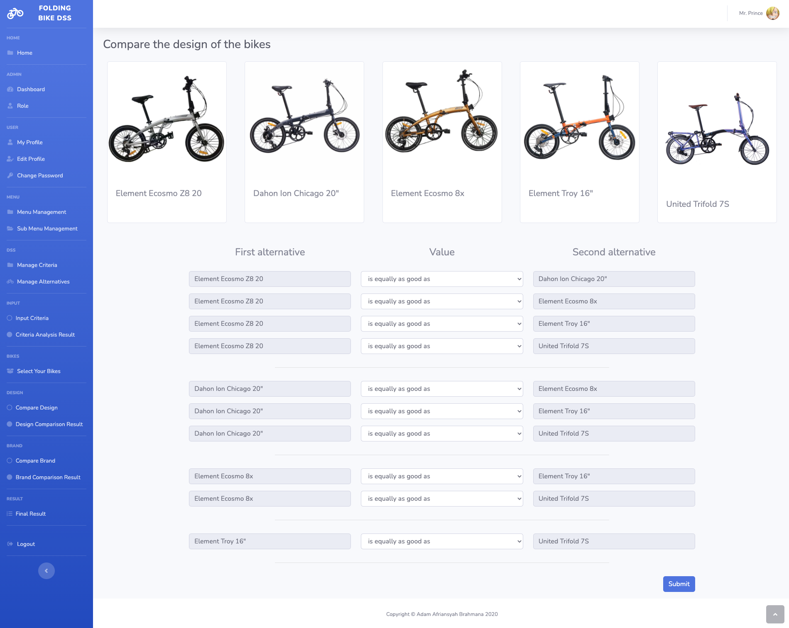
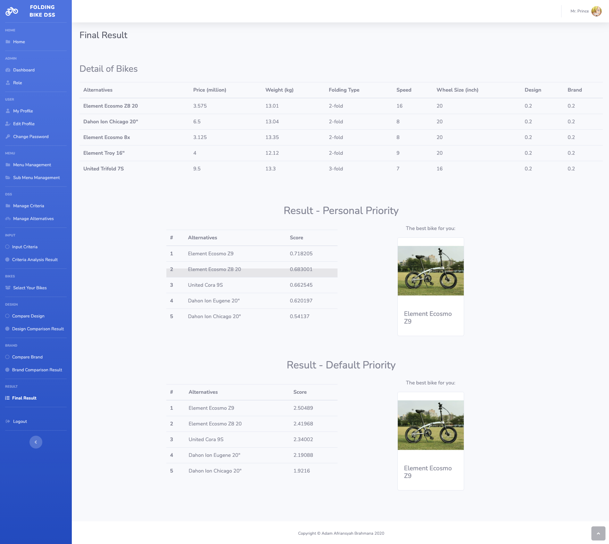

# Decision Support System for Folding Bike Selection

A web-based decision support system to assist people on selecting the best folding bike to buy according to their preferences.

## Decision-making techniques

<ul>
<li>Analytic Hierarchy Process - Weighting</li>
<li>Simple Additive Weighting - Ranking</li>
</ul>

## Criteria being considered

<ul>
<li>Price</li>
<li>Brand</li>
<li>Weight</li>
<li>Folding method</li>
<li>Wheel size</li>
<li>Speed</li>
<li>Design</li>
</ul>

## Screenshots

<pre>
        
</pre>
